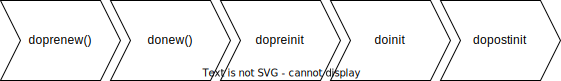

# Backtrader development handbook

```bash
├── __init__.py
├── analyzer.py
├── broker.py
├── cerebro.py
├── comminfo.py
├── dataseries.py
├── errors.py
├── feed.py
├── fillers.py
├── flt.py
├── functions.py
├── indicator.py
├── linebuffer.py
├── lineiterator.py
├── lineroot.py
├── lineseries.py
├── mathsupport.py
├── metabase.py
├── observer.py
├── order.py
├── position.py
├── resamplerfilter.py
├── signal.py
├── sizer.py
├── store.py
├── strategy.py
├── talib.py
├── timer.py
├── trade.py
├── tradingcal.py
├── version.py
└── writer.py
```

For each file, we need to write a Conceptual Explanation, here is an example for the metabase.py


[TOC]

# metabase.py

## Introduction


This file defines some metaclass where it has the following actions when we see `class AnyNewClass(with_metaclass(MetaParams, object)):`

1. Scan all the methods or attributions of the class `AnyNewClass`.
2. Jump to its metaclass `MetaParams`.
	1. Because of the function called `with_metaclass()`, it will direct to its `metaclass.__new__()` which is `MetaParams.__new__` rather than go deeper to the `Metabase`.
	2. First, we need to know things `params`, `frompackages`, and `packages` where they record three things: what do they have, where are they come from, and what do they use?
	3. Both `frompackages`, and `packages` are the default things from Python design. However, we defined a specific attribution for each class called `params` under the function `MetaParams.__new__()`. Here are the ideas of the `params`
		1. If there are no `params` in the class, we will create a null `params` (actually it is the AutoInfoClass), else we just extract its current `params`.
		2. Once we get the following information: `params`, `current class name`, `its base/parent class`, we will combine all the params via the `cls.params = params._derive(name, newparams, morebasesparams)`.
4. Combine the current params with all parent base params via the class `AutoInfoClass`
5. Then we will jump to its original MetaBase class and do all the defined functions like the `doprenew`, `donew`, `dopreinit`, `doinit`, and `dopostinit`.
	1. if there are any functions over-written, for example, `donew` was over-written in the `MetaParams`, it will run the `MetaParams.donew()` rather than `MetaBase.donew()`.
6. We now finished the class definition
7. Stepping into the class initialization.

## Python notes

### super()

```python
# Create the new class - this pulls predefined "params"
cls = super(MetaParams, meta).__new__(meta, name, bases, dct)
```
In Python, `super()` is a built-in function used to refer to the superclass or a parent class. In this specific case, `MetaParams` is a metaclass, and `super(MetaParams)` is used to call its superclass (`MetaBase`). In the expression `super(MetaParams, meta)`, the `meta` refers to the metaclass itself. In this context, `meta` is the metaclass being used, which is an instance of the metaclass `MetaBase`.

---
### \__new__()
```python
class MetaParams(MetaBase):

	def __new__(meta, name, bases, dct):
```
In Python, the `__new__()` method is a special method that is responsible for creating and returning a new instance of a class. It is a static method that is called before the `__init__()` method during the instantiation of an object.

The `__new__()` method is defined in the class itself or in one of its metaclasses. It takes the class as its first argument (`cls`) and any additional arguments that are passed during object creation.
- `meta`: The metaclass of the class being created.
- `name`: The name of the class being created.
- `bases`: A tuple of base classes from which the new class will inherit.
- `dct`: A dictionary containing the attributes and methods defined within the class.
---
### type('MyClass', (), {'attribute': 42})
`type()` function to dynamically create a new class.

```python
# Create a class dynamically using type()
MyClass = type('MyClass', (), {'attribute': 42})

# Create an instance of the dynamically created class
obj = MyClass()

# Access the attribute of the instance
print(obj.attribute)

# output: 42
```

---
### with_metaclass()

The difference between `class MetaLineRoot(metabase.MetaParams):` and `class MetaLineRoot(with_metaclass(MetaParams, object)):` lies in how the metaclass is specified.

1. `class MetaLineRoot(metabase.MetaParams):`
   In this case, the metaclass `MetaParams` is directly specified using the Python 2 syntax for defining a metaclass. This syntax is specific to Python 2, where metaclasses are defined by setting the `__metaclass__` attribute of the class. It is not compatible with Python 3.

2. `class MetaLineRoot(with_metaclass(MetaParams, object)):` (Python 2 and 3)
   This syntax uses the `with_metaclass` utility function to define the metaclass. It is compatible with both Python 2 and Python 3. The `with_metaclass` function takes two arguments: the desired metaclass (`MetaParams` in this case) and the base class (`object` in this case). It ensures the correct application of the metaclass for both Python 2 and 3, abstracting away the differences in metaclass syntax between the two versions.

To summarize, the first syntax (`class MetaLineRoot(metabase.MetaParams):`) is specific to Python 2 and directly sets the metaclass using the `__metaclass__` attribute. The second syntax (`class MetaLineRoot(with_metaclass(MetaParams, object)):`) is compatible with both Python 2 and 3, using the `with_metaclass` function to correctly define the metaclass.

---
### frompackages and packages
In the context of the code snippet you provided, `frompackages` and `packages` are class attributes used to define packages or modules that are associated with the class.

- `frompackages`: It represents a tuple of package names or modules that are imported and used within the class. These packages are typically imported using the `from ... import ...` syntax.
- `packages`: It represents a tuple of package names or modules that are imported but not necessarily used within the class. These packages are typically imported using the `import ...` syntax.

In the code, the `frompackages` and `packages` attributes are extracted from the class dictionary (`dct`). They are later combined with similar attributes from the base classes, and the resulting tuples are assigned to the corresponding class attributes (`cls.frompackages` and `cls.packages`).

By using these attributes, you can specify the required imports for a class and keep them organized within the class definition. This can be useful for managing dependencies and ensuring that the necessary packages are available when using the class.

Note that the specific usage and interpretation of `frompackages` and `packages` attributes can vary depending on the codebase or framework you are working with. The code snippet you provided seems to be part of a larger system that manipulates these attributes in a custom way.

## Concepts

### Event-driven architecture

Event-driven architecture is a fundamental concept in Backtrader and many other trading frameworks. It revolves around the idea of generating and handling events to drive the execution of trading strategies. However, the coding language is not acting like our humans that we can quickly recognize the event, think about the events, make a decision based on the event, and then execute the events. So, to help simulate such a human process, it defines following steps or functions for each class (or role, as each `.py` file will act as a real role.)

1. Do something before the new `event` hits the `role`.
2. The `event` affects.
3. Some preparations before the `role` starting actions
4. The `role` acts as its definition
5. The `role` finishes its actions.

## backtrader.metabase.MetaBase

In this class, Simply see that it only design five steps as follows: 
- Define the rule of any subclass initialization




## backtrader.metabase.MetaParams
- Rename the parent's attribution, leaving space for the child class to use the attribute name.
	- The `newparams` variable serves as a temporary storage space for the parent class's `params` attribute so that the `MetaParams` metaclass can create a new `params` subclass that represents the combined set of parameters from the parent and child classes.
```python
        # Remove params from class definition to avoid inheritance
        # (and hence "repetition")
        newparams = dct.pop('params', ())

        packs = 'packages'
        newpackages = tuple(dct.pop(packs, ()))  # remove before creation

        fpacks = 'frompackages'
        fnewpackages = tuple(dct.pop(fpacks, ()))  # remove before creation

```
> [[Backtrader Python Code Explaination#`newparams = dct.pop('params', ())]]

```python
cls = super(MetaParams, meta).__new__(meta, name, bases, dct)
```

>[[Backtrader Python Code Explaination#`def __new__(cls, name, bases, dct):`]]

## backtrader.metabase.AutoInfoClass

This class will help solve the inherentance of the `params` between the parent class and its children classes.

For each new class, we will add a `params` to its attribution as a default, like what we call in the main code `self.params.XXX`.
The `params` will act as a `AutoInfoClass` where it will combine its base class (or parent class)'s `params`. 

For example, 
```python

class A(AutoInfoClass):
	params = {('myparams',)}
	...

class B(A):
	params = {('sec_params',)}
	...

b = B():
b.params
# {('myparams',), ('sec_params',)}
```

Another important thing is that we need a indicator to stop the recursive process once we fall in the recursive problem, which is the `_getrecurse()`.

# cerebro

## Introduction

It introduces the general function of this whole file and explains the logical of each class over the file.

## Python Notes

It records some advanced python knowledge when we were docing this file. Please add the reference links if necessary.

## Concepts

It will record or explain some high-level design concepts. 

## XX.XX.(Classed in the file)

It will explain the class in following ways:

1. What does it achieve
2. What are the core things in the class
3. How did it work
4. Some examples or resources to help understand this class.
5. ....(Other any helpful things)


